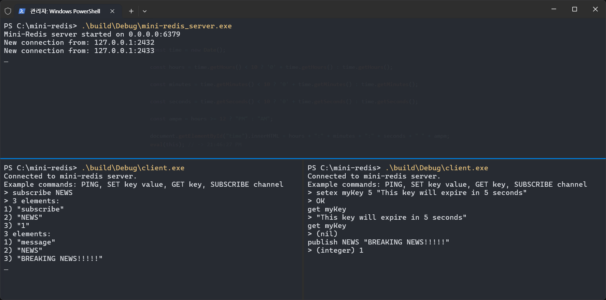

# Mini-Redis 프로젝트 최종 보고서

이 문서는 Mini-Redis 서버의 설계, 구현 및 테스트 과정에 대한 상세한 내용을 담고 있습니다.

## 목차

1.  [**서론 (Introduction)**](./01_Introduction.md)
    -   프로젝트 개요 및 목표
    -   프로젝트의 의의

2.  [**시스템 설계 (System Design)**](./02_System_Design.md)
    -   전체 아키텍처
    -   비동기 네트워크 모델 (Proactor 패턴)
    -   명령어 처리 (Strategy 패턴)
    -   데이터 저장소 설계
    -   메모리 관리 (스마트 포인터)

3.  [**핵심 기능 구현 (Core Feature Implementation)**](./03_Core_Features.md)
    -   RESP (REdis Serialization Protocol)
    -   주요 명령어 구현 (String, Pub/Sub, Expiration)
    -   설정 관리 (YAML)

4.  [**테스트 및 검증 (Testing & Verification)**](./04_Testing.md)
    -   GTest를 이용한 단위 테스트
    -   FastAPI 애플리케이션을 이용한 통합 테스트

5.  [**결론 및 회고 (Conclusion & Retrospective)**](./05_Conclusion.md)
    -   프로젝트 요약
    -   배운 점 (Lessons Learned)
    -   향후 계획 (Future Work)