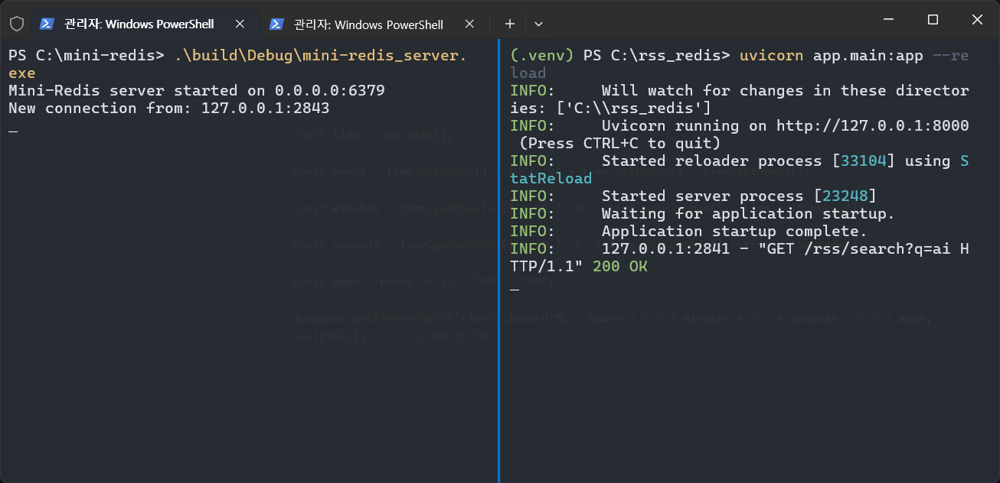

# 4. 테스트 및 검증

[**&#8592; 목차로 돌아가기**](./00_README.md)

서버의 정확성과 안정성을 보장하기 위해 체계적인 테스트 전략을 수립하고 실행했습니다.

## 4.1. GTest를 이용한 Unit Tests

-   **Framework**
    > **Google Test (gtest)**
    > `vcpkg`와 `CMake`를 통해 테스트 환경을 간편하게 구성하여, 모듈별 기능을 검증할 수 있도록 설계  

-   **Test Suites**
    > 테스트는 기능 단위로 스위트를 나누어 구성했습니다:
    >| Test Suite            | 설명                                                                                 |
    >| --------------------- | ---------------------------------------------------------------------------------- |
    >| `GenericCommandsTest` | `DEL`, `KEYS`, `EXPIRE`, `TTL` 등 일반적인 명령어들을 검증                                     |
    >| `PubSubTest`          | `SUBSCRIBE`, `UNSUBSCRIBE`, `PUBLISH` 등 PUB/SUB 로직과 멀티 세션 메시지 전달을 테스트              |
    >| `StringCommandsTest`  | `SET`, `GET`, `INCR`, `DECR`, `INCRBY`, `DECRBY`, `SETEX` 등 문자열 관련 명령어의 동작을 집중 테스트 |

-   **Test Cases**
    >| **테스트 스위트 (Test Suite)**  | **테스트 케이스 (Test Case)**           | **주요 검증 내용**                         |
    >| ------------------------- | --------------------------------- | ------------------------------------ |
    >| **`GenericCommandsTest`** | `Delete`                          | 존재하는 단일 키를 정상적으로 삭제하는지 검증            |
    >|                           | `DeleteNonExistent`               | 존재하지 않는 키 삭제 시 0을 반환하는지 검증           |
    >|                           | `DeleteMultipleKeys`              | 여러 키 삭제 시 삭제된 개수를 정확히 반환하는지 검증       |
    >|                           | `KeysWildcardStar`                | `*` 와일드카드를 사용한 `KEYS` 명령의 결과 검증      |
    >|                           | `KeysWildcardQuestionMark`        | `?` 와일드카드를 사용한 `KEYS` 명령의 결과 검증      |
    >|                           | `ExpireCommand`                   | `EXPIRE` 명령으로 TTL 설정 후 `TTL` 명령으로 확인 |
    >|                           | `KeysWithExpiration`              | 만료된 키가 `KEYS` 결과에서 제외되는지 검증          |
    >| **`PubSubTest`**          | `SingleSubscriberReceivesMessage` | 단일 구독자가 발행된 메시지를 수신하는지 검증            |
    >|                           | `MultiChannelSubscription`        | 한 클라이언트가 여러 채널 구독 시 동작 검증            |
    >|                           | `UnsubscribeFromOneOfMany`        | 특정 채널만 구독 해지 시 올바르게 처리되는지 검증         |
    >|                           | `UnsubscribeFromAll`              | 모든 채널을 한 번에 구독 해지하는 동작 검증            |
    >|                           | `MultiSubscriber`                 | 여러 구독자가 동시에 메시지를 수신하는지 검증            |
    >|                           | `NoSubscribers`                   | 구독자 없는 채널에 발행 시 수신자가 없는지 확인          |
    >|                           | `InvalidCommandInSubMode`         | 구독 모드에서 허용되지 않는 명령 실행 시 오류 검증        |
    >| **`StringCommandsTest`**  | `SetAndGet`                       | `SET`/`GET` 기본 기능 테스트                |
    >|                           | `GetNonExistent`                  | 존재하지 않는 키 조회 시 `null` 반환 검증          |
    >|                           | `SetexAndGet`                     | `SETEX` 값이 만료 전에는 조회 가능한지 확인         |
    >|                           | `SetexExpiration`                 | `SETEX` 값이 만료 후에는 삭제되는지 확인           |
    >|                           | `TTLCommand`                      | `TTL` 명령이 조건별로 -1, 양수, -2를 반환하는지 검증  |
    >|                           | `Incr`                            | `INCR` 명령의 증가 동작 및 예외 처리 검증          |
    >|                           | `Decr`                            | `DECR` 명령의 감소 동작 및 예외 처리 검증          |
    >|                           | `IncrBy`                          | `INCRBY` 명령의 값 증가 및 유효성 검사           |
    >|                           | `DecrBy`                          | `DECRBY` 명령의 값 감소 및 유효성 검사           |


## 4.2. FastAPI 애플리케이션을 이용한 통합 테스트

-   **목표**
    > Mini-Redis가 Python Redis 클라이언트(`redis-py`)와 호환 가능하며, 기존 Redis를 대체하여 실제 애플리케이션 환경에서 정상적으로 동작할 수 있는지를 검증했습니다.
-   **테스트 환경**
    > 뉴스를 파싱하고 캐시에 저장하여 조회하는 FastAPI 애플리케이션 rss-redis를 활용, 라이브러리 `redis-py` 라이브러리 사용
-   **검증 절차**
    1.  mini-redis-server를 Redis와 동일한 포트인 6379로 실행
    2.  FastAPI 애플리케이션 rss-redis의 코드 수정 없이 실행
           ``` python
           r = redis.Redis(host=REDIS_HOST, port=REDIS_PORT, decode_responses=True)
           ```
    3. CLI rss-redis API Endpoints 조회
       ``` bash
       curl "http://127.0.0.1:8000/rss/search?q=ai"
       curl "http://127.0.0.1:8000/rss/keys"
       curl -X DELETE "http://127.0.0.1:8000/rss/cache"
       ```
-   **서버, 클라이언트 실행 mini-redis-server and rss-redis**
    > 

-   **/rss/search?q=ai**
    > 
    > 


---
[**&#8592; 이전: 핵심 기능 구현**](./03_Core_Features.md) | [**다음: 결론 및 회고 &#8594;**](./05_Conclusion.md)